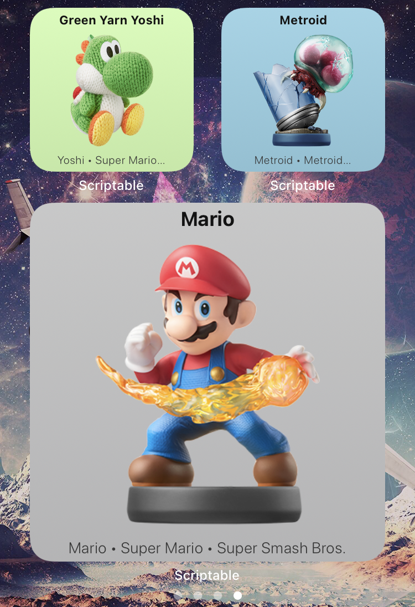
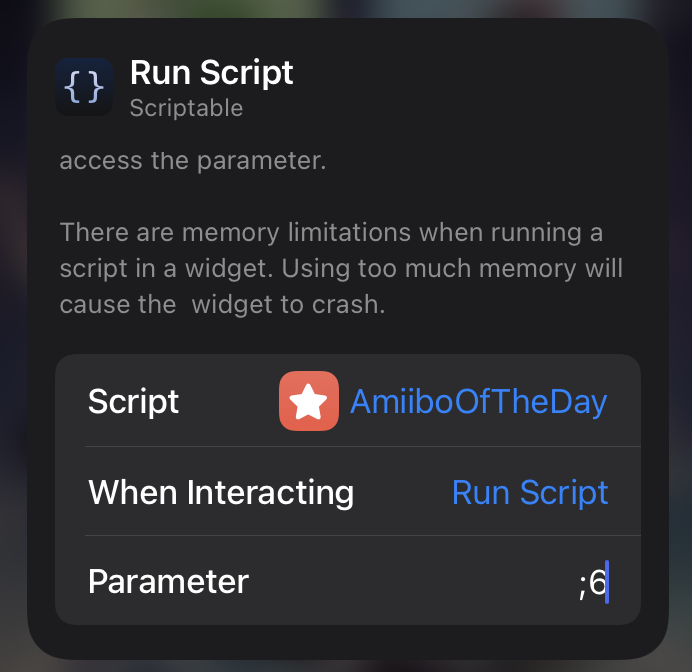

# AmiiboOfTheDay

Scriptable iOS Widget to display a new random Nintendo Amiibo every day

## Installation

### Manual

* Download Scriptable App for iOS Devices - https://scriptable.app
* Download/Import of `AmiiboOfTheDay.js` File to `iCloud/Scriptable`
* Create new Scriptable Widget on the Homescreen and choose script `Amiibo of the Day`

### ScriptDude

* Get `Scriptable` and `ScriptDude` from [https://scriptdu.de](https://scriptdu.de/#installation)
* Get `Amiibo of the Day` [here](https://scriptdu.de/?name=Amiibo%20Of%20The%20Day&source=https%3A%2F%2Fraw.githubusercontent.com%2Fdominik-lueke%2FAmiiboOfTheDay%2Fmain%2FAmiiboOfTheDay.js&docs=https%3A%2F%2Fgithub.com%2Fdominik-lueke%2FAmiiboOfTheDay%2Fblob%2Fmain%2FREADME.md)

## Features

- Name, Character, Game Series, Amiibo Series fetched from https://amiiboapi.com
- Background color based on Amiibo Series
- English language
- Optimized for large and small widgets; Layouts and Scales tested on iPhone 8

## Usage
* Best set `When Interacting` to `Run Script`

### Parameter 

`[MAX_ID[;UPDATE_INTERVAL]]`

#### MAX_ID (optional)
Set maximum id of Amiibos to choose from randomly. The id represents order of the amiboos delivered by the API.
   
Default is the maximum .

Use Value `#<Name>` to permanently display your favourite Amiibo by Name.

#### UPDATE_INTERVAL (OPTIONAL)
Set the update Interval in hours `[1-24]`. 

Default is `24`.

#### Examples

&nbsp;

`#Mario`: Display "Mario" (you can find the available names in file `iCloud\scriptable\amiiboOfTheDay\full\names` where for every Amiibo the `<name> (<series>)` information is stored.

`;6`: Display a new random Amiibo every 6 hours

## Please Note

* The script caches Amiibo data and images in directory `iCloud\scriptable`

## Open Issues

* Some Amiibos have the same name. When directly chossing an Amiibo name as parameter, the first Amiibo from the API which has the name is displayed.
